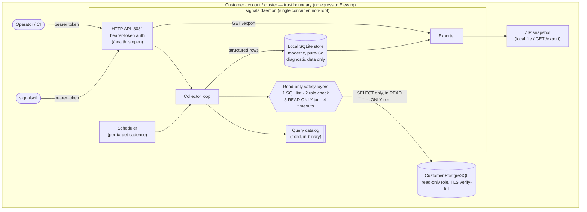

# Architecture

Elevarq Signals is a single, self-contained daemon that a customer runs **inside
their own environment**. It connects to one or more PostgreSQL instances with a
read-only role, runs a fixed catalog of diagnostic queries on a schedule, stores
the results in a local database, and packages them as portable ZIP snapshots.

The defining property is the **trust boundary**: everything runs in the
customer's account/cluster, the only outbound connections are to the customer's
own PostgreSQL targets, and **no data ever leaves that boundary** — no telemetry,
no analytics, no phone-home, no cloud uplink.

## Component & data-flow diagram

## Components

| Component | Responsibility |
|---|---|
| **HTTP API** (`internal/api`) | Local control plane on `:8081`. Bearer-token-authenticated for every endpoint (`/status`, `/collect/*`, `/reload`, `/export`, `/metrics`); only `GET /health` is open. Token compared in constant time. |
| **Scheduler + Collector loop** (`internal/collector`) | Drives per-target collection at the configured cadence, resolves the connection credential just-in-time, opens the read-only connection, runs the catalog, and writes results. A per-target circuit breaker isolates a failing target without affecting others. |
| **Query catalog** (`internal/pgqueries`) | The fixed, in-binary set of read-only diagnostic queries (the only SQL the daemon ever runs). Auditable from source. |
| **Read-only safety layers** (`internal/safety`, `internal/collector`) | Four independent layers — static SQL linting at startup, per-target role-attribute validation (blocks superuser / replication / bypassrls), a session `READ ONLY` transaction, and transaction-scoped statement/lock/idle timeouts. Detailed in [runtime-safety-model.md](runtime-safety-model.md). |
| **Local store** (`internal/db`) | An embedded SQLite database (`modernc.org/sqlite`, pure-Go, `CGO_ENABLED=0`) holding collected diagnostic rows and snapshot state. Holds **diagnostic data only** — credentials are never persisted. |
| **Exporter** (`internal/export`) | Packages collected data into portable ZIP snapshots (structured JSON/NDJSON) for download via `GET /export` or local file. |
| **signalsctl** (`cmd/signalsctl`) | Operator CLI — a thin client over the same authenticated HTTP API (status, collect, export, doctor, connect). |

## Collection cycle

1. The scheduler selects a due target.
2. The collector resolves the credential at connect time — from a mounted file / env var, a cloud-IAM token (AWS RDS IAM, Azure Entra, GCP Cloud SQL IAM), or a cloud secret store reference. **Nothing is stored in config or persisted.** See [database-connections.md](database-connections.md).
3. It opens a TLS connection (`verify-full` in production) and validates the role is safe (no superuser / replication / bypassrls).
4. It runs the catalog inside a single `READ ONLY` transaction with defensive timeouts.
5. Structured results are written to the local store; a per-cycle audit event is emitted (metadata only — never credentials or row payloads with secrets).
6. On demand, the exporter assembles the latest results into a ZIP snapshot.

## Trust boundary, data handling & egress

- **Runs entirely in the customer's account/cluster.** Elevarq operates nothing on the customer's behalf and receives no customer data — so there is no Elevarq-side data-processing surface.
- **Outbound connections:** only to the customer's configured PostgreSQL targets. No other network egress.
- **No telemetry / no phone-home / no auto-update.** The Prometheus `/metrics` endpoint is off by default and, when enabled, is local-only.
- **Credentials:** read at connect time, used for a single connection, never cached, never written to the store, logs, metrics, audit events, or exports.
- **Data at rest:** the local store holds diagnostic data only and is plaintext at the application layer; at-rest encryption is provided by the customer's encrypted volume (encrypted EBS / PVC `storageClass` / host FDE). See [runtime-safety-model.md](runtime-safety-model.md).

## Deployment topology

A single non-root container (digest-pinned, multi-arch amd64/arm64, read-only root filesystem, all capabilities dropped). Deployed via the Helm chart (`oci://ghcr.io/elevarq/charts/signals`) with liveness/readiness probes on `/health`, resource limits, an optional NetworkPolicy (deny-all except DNS + the Postgres targets), and a dedicated ServiceAccount with no Kubernetes API access. The connection password and API token are injected from Kubernetes Secrets; collector configuration is mounted read-only from a ConfigMap. See [install/kubernetes-production.md](install/kubernetes-production.md) and [container.md](container.md).
